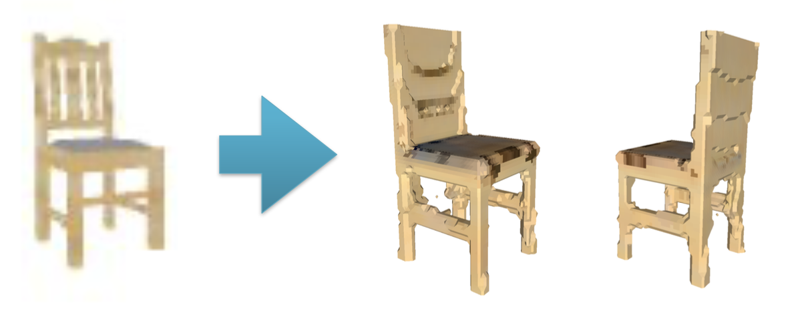
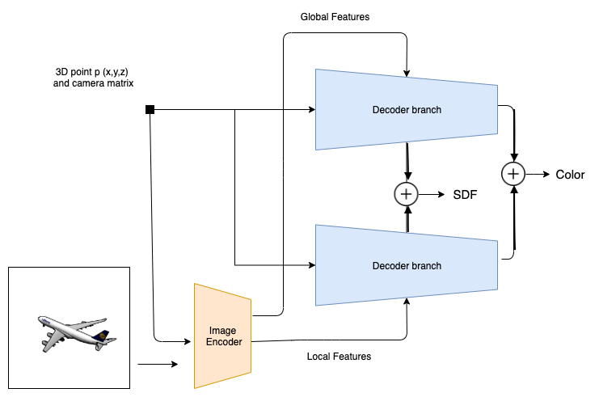
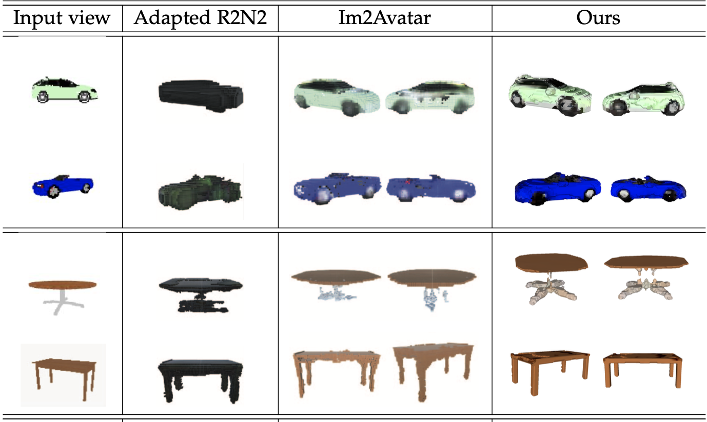

# Deep implicit network for single-view textured 3D reconstruction
Single-view textured 3D object reconstruction  

* Input: A single image,camera matrix 
* Output : Textured 3D object  

   

  In this paper, we propose a Deep implicit network for single-view textured 3D reconstruction, an end-to-end network which can reconstruct both 3D surface and texture from a single 2D image for multiple classes. Our network implicitly represents the 3D surface as the continuous decision boundary of a deep neural network classifier. In contrast to the explicit representation like voxel, mesh, and points cloud, our representation encodes a description of the 3D output at an infinite resolution without more memory usage. Furthermore, Our network first predicts geometry, followed by color, so that the color predictions can be directly informed by the geometric structure.

# Architecture

 Given an image of an object and a camera matrix, our method reconstructs the textured 3D shape by iteratively querying all the points in the sampled points cloud.

 


# Dependencies
h5py==2.10.0  
open3d==0.10.0.0  
tensorflow == 1.10.0  
matplotlib==3.3.1  
opencv==4.2.0  
scikit-learn==0.23.2  
trimesh==3.8.13  

# Data preparation
## Download data from Im2Avatar
```
wget https://www.dropbox.com/s/s03fc1rx4ljkhix/ShapeNetCore_im2avatar.tar.gz
``` 
## Data preprocessing
* Put the gen_db.py inside the downloaded im2avatar dataset directory and run it under the Desktop env
```
pyhton gen_db.py
```
* Modify the dataset location in preprocessing/info.json file 
```
"raw_dirs_v1": {
     
        "sdf_dir": "/media/sdb/kuanhsun/im2avatar/",
        "rendered_dir": "/media/sdb/kuanhsun/im2avatar/",
        "renderedh5_dir": "/media/sdb/kuanhsun/im2avatar/"
    }
```	

## Download the pre-trained Vgg16 Net and put it under models/CNN/pretrained_model

```
wget http://download.tensorflow.org/models/vgg_16_2016_08_28.tar.gz 
```


# Run 

```
python train/train_sdf.py
```

# Evaluation

```
python eval/eval.py
```


# Get Mesh

* After getting the output sdf .txt file, run the code under the Desktop env to convert it to mesh

```
python eval/to_mesh.py
``` 

#Citation

```
@article{sun2018im2avatar,
  title={Im2Avatar: Colorful 3D Reconstruction from a Single Image},
  author={Sun, Yongbin and Liu, Ziwei and Wang, Yue and Sarma, Sanjay E},
  journal={arXiv preprint arXiv:1804.06375},
  year={2018}
}

@incollection{NIPS2019_8340,
title = {DISN: Deep Implicit Surface Network for High-quality Single-view 3D Reconstruction},
author = {Xu, Qiangeng and Wang, Weiyue and Ceylan, Duygu and Mech, Radomir and Neumann, Ulrich},
booktitle = {Advances in Neural Information Processing Systems 32},
editor = {H. Wallach and H. Larochelle and A. Beygelzimer and F. d\textquotesingle Alch\'{e}-Buc and E. Fox and R. Garnett},
pages = {492--502},
year = {2019},
publisher = {Curran Associates, Inc.},
url = {http://papers.nips.cc/paper/8340-disn-deep-implicit-surface-network-for-high-quality-single-view-3d-reconstruction.pdf}
}
```
